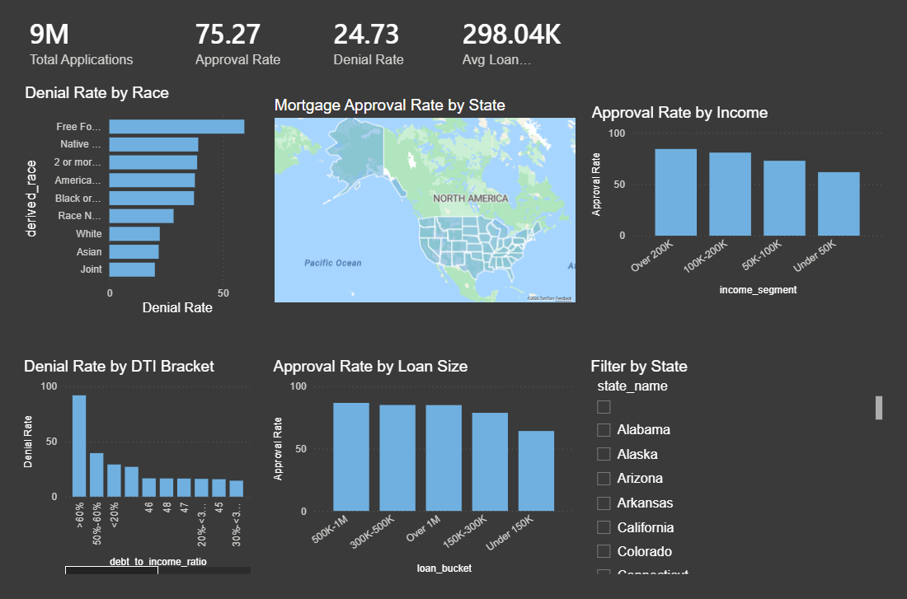
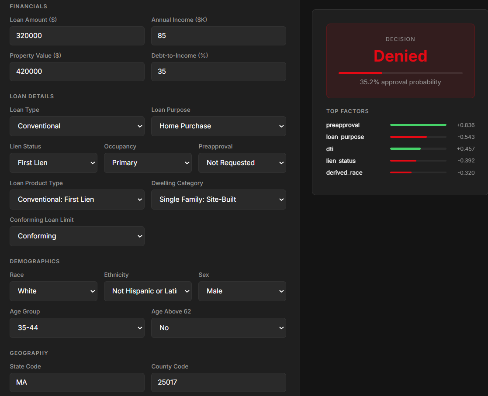
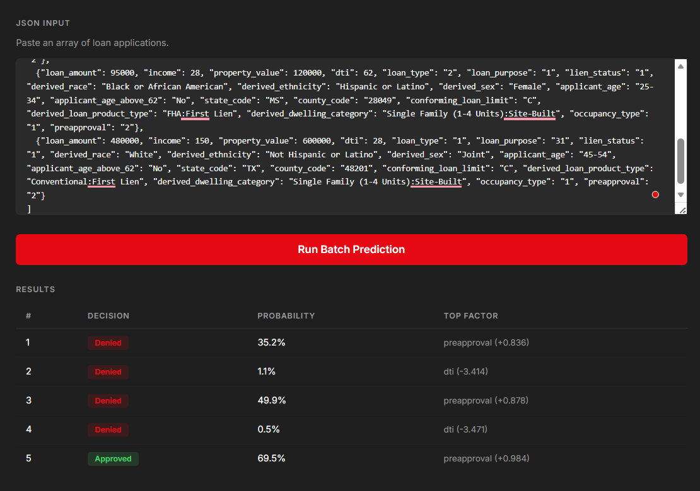
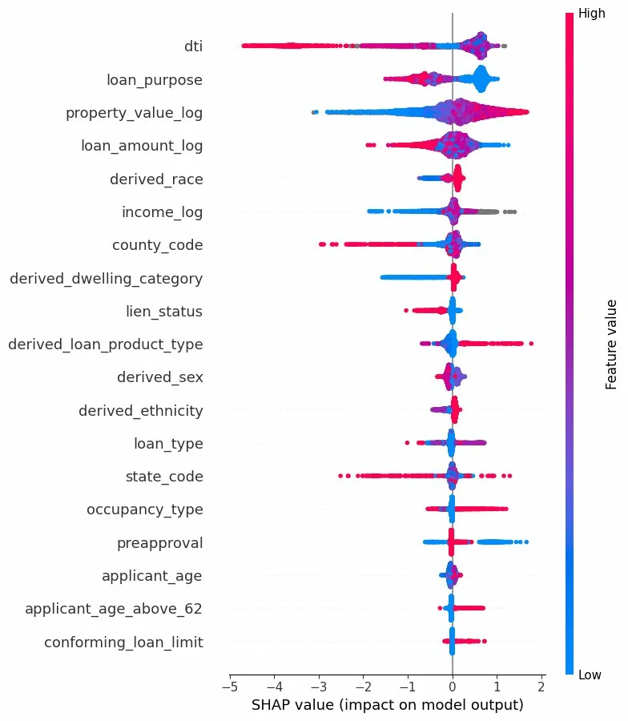
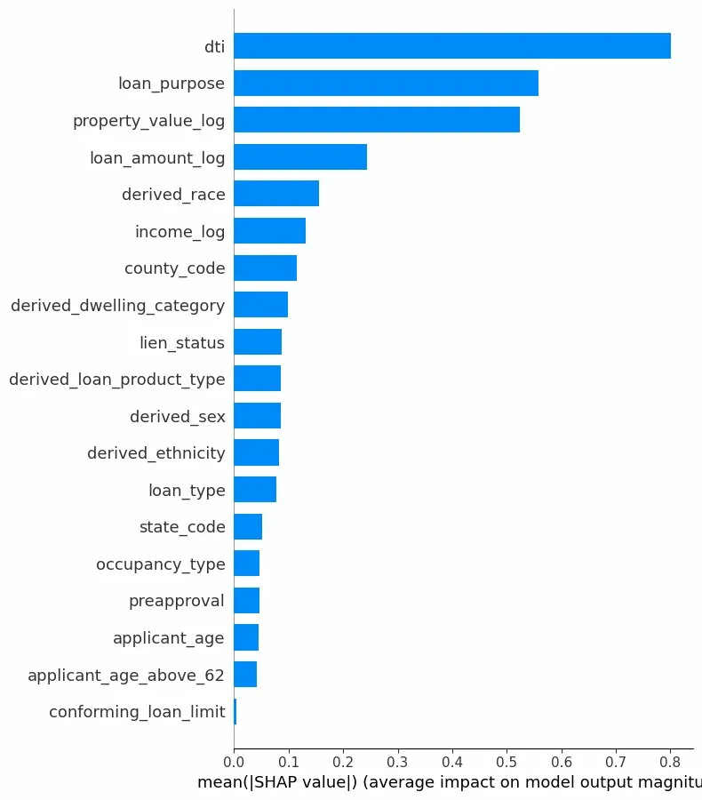

# CreditIQ — Mortgage Risk Scoring


End-to-end machine learning system for predicting mortgage loan approval outcomes — trained on **8.6 million real loan applications** from the FFIEC/CFPB HMDA 2024 national dataset. Includes SHAP explainability, demographic bias auditing, a REST API with a dark UI, and an interactive Power BI dashboard.

---

## Dashboard



*9M applications · 75.3% approval rate · 24.7% denial rate · $298K avg loan — filterable by state*

---

## Prediction UI



*Real-time loan approval prediction with SHAP-based explanation of top contributing factors*

---

## Batch Prediction



*Batch endpoint accepts multiple applications at once and returns decisions, probabilities, and top factors for each*

---

## SHAP Explainability



*Beeswarm plot showing direction and magnitude of each feature's impact on approval probability across 10,000 test samples*



*Global feature importance ranked by mean absolute SHAP value — DTI is the dominant predictor by a wide margin*

---

## Why This Project

Mortgage approval models are in production at every major bank and lender. The **Fair Housing Act** and **Equal Credit Opportunity Act** legally require lenders to explain denials and audit for demographic bias — making SHAP explainability a regulatory necessity, not just a portfolio add-on. This project mirrors that full production pipeline end-to-end.

---

## Tech Stack

| Layer | Tool |
|---|---|
| Data Source | FFIEC/CFPB HMDA 2024 National Snapshot (12.2M rows) |
| Storage & Querying | DuckDB |
| Modeling | LightGBM, XGBoost, Random Forest, Logistic Regression |
| Explainability | SHAP TreeExplainer |
| Backend | FastAPI |
| Frontend | HTML / CSS / JavaScript |
| Dashboard | Power BI |
| Environment | Python, Google Colab, pandas, scikit-learn |

---

## Model Comparison

Trained on 6.94M samples (80/20 stratified split). Logistic Regression and Random Forest trained on 500K subsample due to scale.

| Model | ROC-AUC | Accuracy | F1 (Denied) | Train Time |
|---|---|---|---|---|
| **LightGBM** | **0.877** | 0.819 | **0.670** | 189s |
| XGBoost | 0.868 | 0.834 | 0.516 | 130s |
| Random Forest | 0.853 | 0.846 | 0.618 | 77s |
| Logistic Regression | 0.750 | 0.706 | 0.528 | 72s |

LightGBM selected as final model — best ROC-AUC and best F1 on the denied class, which is the harder and more consequential class for real-world use.

---

## Data Pipeline

- Source: [FFIEC/CFPB HMDA 2024 National Snapshot](https://ffiec.cfpb.gov/data-publication/snapshot-national-loan-level-dataset/2024)
- Raw: 12.2M rows, 99 columns, all VARCHAR due to mixed "Exempt" values
- Loaded into DuckDB using `read_csv_auto` with `all_varchar=1`
- Filtered to approved (action_taken 1, 2) and denied (3, 7) only → **8.68M rows**
- Dropped post-approval leaky columns: `interest_rate`, `rate_spread`, `loan_term`
- Log-transformed skewed columns: `loan_amount`, `income`, `property_value`
- Parsed `debt_to_income_ratio` from range strings (e.g. `"20%-<30%"`) to numeric

---

## SQL Analysis

Five analytical queries run directly on DuckDB across 8.68M records.

**Approval Rate by Income**
| Segment | Approval Rate |
|---|---|
| Over $200K | 84.3% |
| $100K–$200K | 80.8% |
| $50K–$100K | 72.8% |
| Under $50K | 50.9% |

**Denial Rate by Race**
| Race | Denial Rate |
|---|---|
| Native Hawaiian / Pacific Islander | 39.1% |
| American Indian / Alaska Native | 37.6% |
| Black or African American | 37.3% |
| White | 22.2% |
| Asian | 21.7% |

**DTI vs Denial Rate**
| DTI | Denial Rate |
|---|---|
| > 60% | 91.7% |
| 50%–60% | 39.4% |
| 30%–36% | 14.5% |

**Approval Rate by Loan Size**
| Loan Size | Approval Rate |
|---|---|
| $500K–$1M | 86.6% |
| $300K–$500K | 84.9% |
| Under $150K | 64.1% |

---

## Key Findings

- **DTI is the #1 denial driver** — DTI above 60% results in a 91.7% denial rate, effectively a hard cutoff
- **Racial lending disparity confirmed** — Black and Native American applicants denied at ~15 percentage points higher than White applicants, corroborated by SHAP values showing `derived_race` as the 5th most impactful feature
- **Income gap is severe** — 33 percentage point approval gap between under $50K and over $200K income segments
- **Larger loans get approved more easily** — $500K–$1M loans approved at 86.6% vs 64.1% for under $150K, reflecting lower risk on high-value properties in strong markets
- **Regional disparities** — Midwest states approve at 83–85%, Southern states at 69–71%

---

## API

**Run locally:**
```bash
cd api
pip install fastapi uvicorn lightgbm shap pandas numpy scikit-learn joblib
uvicorn app:app --reload
```

Open `http://localhost:8000` for the UI or `http://localhost:8000/docs` for Swagger.

**POST /predict — single application**
```json
{
  "loan_amount": 320000,
  "income": 85,
  "property_value": 420000,
  "dti": 35,
  "loan_type": "1",
  "loan_purpose": "1",
  "lien_status": "1",
  "derived_race": "White",
  "derived_ethnicity": "Not Hispanic or Latino",
  "derived_sex": "Male",
  "applicant_age": "35-44",
  "applicant_age_above_62": "No",
  "state_code": "MA",
  "county_code": "25017",
  "conforming_loan_limit": "C",
  "derived_loan_product_type": "Conventional:First Lien",
  "derived_dwelling_category": "Single Family (1-4 Units):Site-Built",
  "occupancy_type": "1",
  "preapproval": "2"
}
```

**Response:**
```json
{
  "decision": "Approved",
  "probability": 0.8741,
  "top_factors": {
    "dti": 0.312,
    "loan_purpose": 0.187,
    "property_value_log": 0.143,
    "loan_amount_log": 0.098,
    "derived_race": -0.071
  }
}
```

**POST /predict/batch** — accepts a list of applications, returns decisions for all.

## Data Source

FFIEC/CFPB Home Mortgage Disclosure Act (HMDA) 2024 National Snapshot
https://ffiec.cfpb.gov/data-publication/snapshot-national-loan-level-dataset/2024